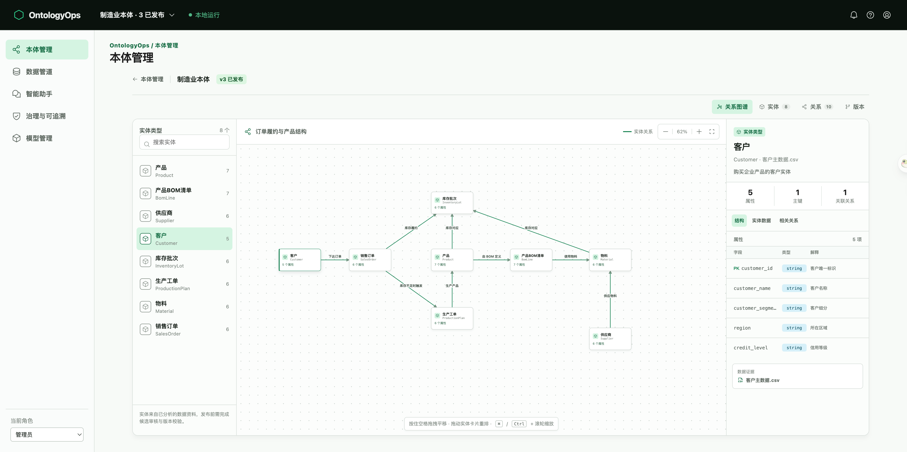

# OntologyOps

> 本地单租户的企业本体与受治理智能助手 MVP。

OntologyOps 是一个用于学习和演示“数据 + 本体 + AI 应用 + 治理”路径的最小闭环项目。它以制造业为示例领域，支持从业务资料创建本体、将 CSV 数据经受控管道映射到实体实例，并让智能助手基于已发布本体进行可追溯的只读问答。



## 项目边界

- 本项目借鉴企业本体、数据集版本、受控工具调用和可追溯性等产品理念，用于产品学习与本地演示。
- 它不是 Palantir Foundry、AIP 或其官方实现，与 Palantir Technologies Inc. 不存在隶属、合作或背书关系。
- 当前为本地单租户 MVP，适合演示与二次开发，不适合直接用于生产环境。

## 已实现的闭环

1. **本体管理**：上传业务文件，由大模型生成实体、属性和关系候选；经人工问答确认后发布本体版本，并以关系图谱查看结构与实例。
2. **数据管道**：批量上传 CSV，形成原始数据集版本，执行清洗/质量校验，将可信数据映射并填充至已发布本体的实体类型。
3. **智能助手**：企业数据问题只调用已发布本体的受控只读工具，不生成自由 SQL；没有已映射数据时会明确说明。其他通用问题可由配置的大模型回答，但不会读取企业数据。
4. **治理与可追溯**：展示质量规则结果、数据血缘和最近事件，保留数据源、数据集、映射、实体实例与工具调用的证据链。
5. **模型管理**：支持 DeepSeek、ChatGPT（OpenAI）和其他 OpenAI 兼容接口。API Key 仅保存在本机 `.env`，不会进入浏览器、SQLite 或审计日志。

## 技术栈

- 前端：React、TypeScript、Vite、XYFlow
- 后端：FastAPI、SQLAlchemy
- 本地数据：SQLite、DuckDB、Parquet
- 模型接口：DeepSeek、OpenAI 与 OpenAI-compatible API

## 快速开始

### 前置条件

- Python 3.11+
- Node.js 20+
- npm 10+

### 1. 安装依赖

```bash
git clone https://github.com/GroMach-AI/ontologyops.git
cd ontologyops

python3 -m venv backend/.venv
backend/.venv/bin/pip install -r backend/requirements.txt

cd frontend
npm ci
cd ..
```

### 2. 可选：配置模型

```bash
cp .env.example .env
```

在 `.env` 中只填写你准备使用的本机 Key。未配置真实模型时，仍可使用 Mock 模式体验界面与受控流程。

### 3. 启动

```bash
./scripts/dev.sh
```

打开 [http://127.0.0.1:5173](http://127.0.0.1:5173)。脚本会同时启动前端和 API，并将本地运行数据写入被 Git 忽略的 `data/runtime/`。

## 推荐演示路径

1. 在“模型管理”测试并配置一个模型，或保留 Mock 模式。
2. 在“本体管理”上传业务资料，确认模型提取的实体、字段与关系，并发布本体。
3. 在“数据管道”批量上传 CSV，执行预览运行、质量校验和实体映射。
4. 回到本体图谱查看实体实例及字段证据。
5. 在“智能助手”询问如“有多少销售订单？”、“有哪些供应商？”，查看受控查询结果和证据。
6. 在“治理与可追溯”查看质量结果、血缘与最近事件。

## 测试

```bash
# 后端
cd backend
.venv/bin/python -m pytest -q

# 前端（另开终端）
cd frontend
npm test -- --run
npm run lint
npm run build
```

## 当前不做

- 写回、审批、自动 Action 或自动任务
- 通用 BI、风险驾驶舱、多租户
- 自由 text-to-SQL
- 生产级调度、多源连接器、规模化计算与完整权限体系

## 项目文档

- [PRD](docs/01-PRD.md)
- [技术方案](docs/02-Technical-Design.md)
- [项目进度状态](docs/03-Project-Status.md)
- [开发版本控制规则](docs/04-Development-Version-Control.md)

## 许可证

本项目采用 [MIT License](LICENSE)。
