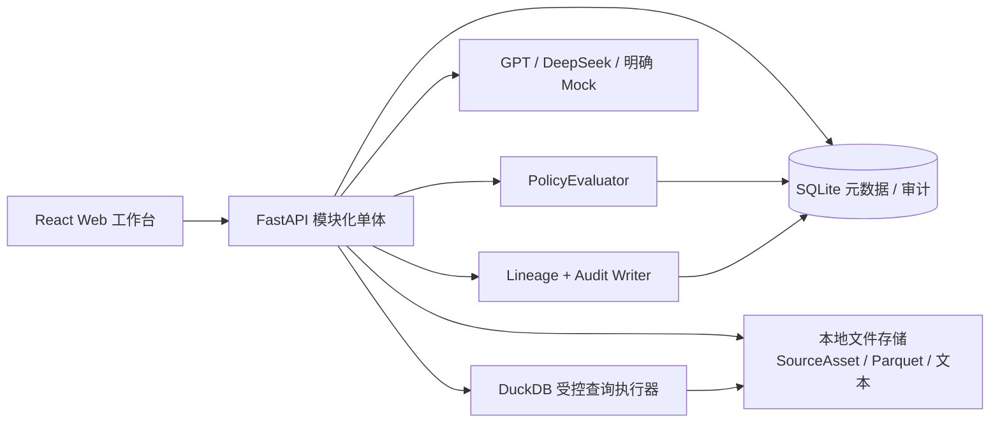
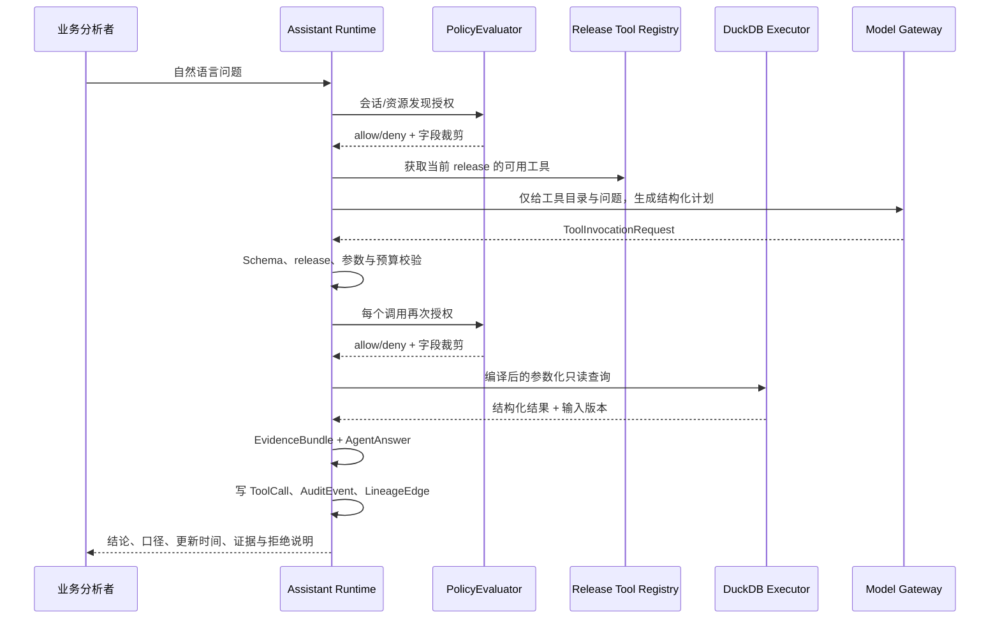

# OntologyOps 技术方案

| 字段 | 内容 |
| --- | --- |
| 版本 | v1.0-draft |
| 状态 | 待产品负责人评审；不授权开发 |
| 对应需求 | `01-PRD.md` v1.0-draft |
| 对应视觉原型 | `prototypes/` 中已验收的静态页面 |
| 目标形态 | 本地运行、单租户、受治理的企业本体与智能助手 MVP |

## 0. 结论与技术决策

OntologyOps v1 采用**模块化单体**，而不是微服务或通用数据平台：一个 FastAPI 后端负责资源、运行、策略和 API；React/Vite 负责工作台；SQLite 保存平台元数据与审计；本地 Parquet + DuckDB 承担上传数据的受控读取与聚合。

本体不是 SQL 的替代层。对象、属性、Link、指标、函数和规则发布后会编译为一个**只读、版本固定的查询目录**。智能助手只能从目录中选择受授权的工具并提交结构化参数；运行时将工具计划校验、授权并编译为参数化 DuckDB 查询。模型、前端和用户问题均不能下发自由 SQL、表名或任意代码。

首个开发目标不是把既有工厂演示“修补成通用能力”，而是先交付一条新数据端到端链路：

```text
新上传 SourceAsset
  → DatasetVersion / PipelineRun / QualityRun
  → Mapping / OntologyDraft
  → immutable OntologyRelease
  → ToolRegistryEntry
  → PolicyDecision / ToolCall
  → AgentAnswer / EvidenceBundle / AuditEvent
```

## 1. 当前仓库审计与迁移原则

### 1.1 可保留的技术基座

当前仓库已有 FastAPI、SQLAlchemy、SQLite、DuckDB、Pandas/OpenPyXL、PyPDF/python-docx、React/Vite、TypeScript 和 Vitest。它们适合本地单租户 MVP，可作为技术基座继续使用。

### 1.2 不可作为 v1 能力基础的旧实现

下列内容与新 PRD 冲突，不能直接作为正式实现或验收依据：

| 现状 | 问题 | v1 处理 |
| --- | --- | --- |
| `SemanticTools` 中固定工厂表名、固定 SQL、固定日期与固定风险条件 | 违反“新上传数据”“受发布本体控制”“禁止自由/硬编码查询”的原则 | 从运行时主路径移除；仅保留为迁移前参考，不接入 v1 ToolRegistry。 |
| `AgentService` 的关键词分支、固定回答和固定 provenance | 将特定工厂问答包装为通用 Agent | 用“目录发现 → 结构化计划 → 策略决策 → 工具执行 → 证据组装”替换。 |
| 进程内 `RESTRICTED_FIELDS` 与角色判断 | 策略不可配置、无版本、不能统一解释页面与工具访问 | 替换为持久化 AccessPolicy 与同一 PolicyEvaluator。 |
| `OntologyVersion.definition_json` 的单 JSON 快照 | 无细粒度资源 ID、依赖、映射版本、候选与发布影响 | 迁移为资源表、版本快照与不可变 release manifest。 |
| README 中“已实现”与已删除历史文档的引用 | 与新 PRD、验收门禁矛盾 | 开发开始时更新 README；不在本技术方案批准前改代码。 |

### 1.3 迁移纪律

- 不迁移旧工厂 seed 数据作为验收数据；可留在 `legacy/` 或隔离测试夹具中，但默认运行和演示不得加载。
- 元数据数据库采用新的 schema migration 起点；在开发环境先备份旧 SQLite 文件，不做风险很高的就地字段猜测迁移。
- 旧 API 仅在重建期间保留为内部兼容层；最终 API 以本方案的资源契约为准。
- 任何“已有测试通过”都不构成新 PRD 的浏览器验收通过。

## 2. 架构边界



### 2.1 单体内模块

| 模块 | 职责 | 不承担的职责 |
| --- | --- | --- |
| Resource Core | 资源 ID、版本、状态机、依赖边、影响分析、审计入口 | 不解析文件、不执行业务查询。 |
| Ingestion & Pipeline | 上传、解析、schema/profile、受控转换、数据集版本与运行记录 | 不直接发布本体。 |
| Quality | 规则定义、运行、异常样本、可信决策 | 不自动修复数据。 |
| Ontology Authoring | 草稿、对象/属性/Link/映射/指标/函数/规则、候选审核、发布/回滚 | 不允许 Action、写回或任意脚本。 |
| Release Compiler | 将 release 编译为只读 ObjectProjection、ToolRegistryEntry 与依赖清单 | 不调用模型，不执行用户 SQL。 |
| Governance | Policy、字段裁剪、资源可见性、血缘与审计 | 不对接企业 IAM/SSO。 |
| Model Gateway | GPT、DeepSeek、Mock 的配置、连通性验证、调用审计 | 不保存 API Key，不做模型训练。 |
| Assistant Runtime | 计划、工具发现、授权、工具执行、证据与回答组装 | 不直连表、文件或外部业务系统。 |

### 2.2 进程与持久化

| 组件 | v1 方案 | 原因 |
| --- | --- | --- |
| API / 任务执行 | 单个 FastAPI 进程内的持久化任务执行器；小数据量下串行处理 | 降低本地部署与失败恢复复杂度；每个 run 可重试。 |
| 元数据 | SQLite（启用 foreign keys、WAL、迁移版本表） | 单租户、资源关系强、便于备份。 |
| 数据 | 只读本地文件：原始文件 + 每个 DatasetVersion 对应的 Parquet | 保留源证据，DuckDB 可直接查询版本文件。 |
| 查询 | DuckDB 只读连接，工具执行期间按 release manifest 生成参数化 SQL | 适合列式数据和聚合，且不暴露 SQL 接口。 |
| 文档 | 原文件和提取后的纯文本；文本片段作为 SourceAsset 子资源 | 用于建模证据，不建设通用知识库。 |
| 密钥 | 仅操作系统环境变量或本地未跟踪 `.env`；数据库只记录 `secret_ref` 名称 | 避免密钥进入页面、审计、导出和数据库备份。 |

任务执行器在进程重启后将遗留 `running` run 标为 `interrupted`，用户可以点击“重试”，产生新的 run ID；不得把未完成运行伪装为成功。

## 3. 目标资源模型

所有可追溯实体统一拥有以下元数据：

```text
resource_id, resource_type, display_name, lifecycle_status,
created_at, created_by, updated_at, version, content_hash, metadata_json
```

`ResourceRelation` 记录 `from_resource_id → to_resource_id`、`relation_type`、`created_at` 与 `created_by`。它是血缘、影响分析和发布校验的唯一关系来源；页面不自行拼装固定血缘。

### 3.1 资源表与不可变记录

| 领域 | 关键实体 | 关键约束 |
| --- | --- | --- |
| 数据 | SourceAsset、Dataset、DatasetVersion、DatasetProfile | DatasetVersion 关联不可变 source/output 文件与 schema hash；不可覆盖旧版本。 |
| 管道 | Pipeline、PipelineNode、PipelineRun、NodeRun | NodeRun 显式记录输入/输出 DatasetVersion、行数、错误与配置 hash。 |
| 质量 | QualityRule、QualityRun、QualityFinding | Rule 与 Run 绑定 DatasetVersion；Finding 保存行定位或样本值引用。 |
| 本体 | Ontology、OntologyDraft、OntologyRelease、ObjectType、Property、LinkType、Mapping | 草稿可编辑；release 不可编辑，只能 supersede/rollback。 |
| 动能 | Metric、ReadFunction、BusinessRule | 全部声明输入资源、返回契约、release ID；不存在 Action 表或副作用字段。 |
| 治理 | Role、AccessPolicy、PolicyDecision、AuditEvent、ResourceRelation | PolicyDecision 必须关联主体、目标、操作、策略版本、allow/deny 与原因。 |
| AI | ModelProvider、ModelProfile、AgentSession、ToolRegistryEntry、ToolCall、AgentAnswer、EvidenceItem | ToolCall 绑定 release、计划、授权决定、参数摘要、输出摘要与证据资源。 |

### 3.2 状态机落地

状态转换由后端 `LifecycleService` 统一校验，不允许前端直接写状态字段。

| 类型 | 状态 | 关键保护 |
| --- | --- | --- |
| DatasetVersion | `registered → profiled → trusted / rejected` | `trusted` 前必须至少完成 profile 与指定质量 run。 |
| PipelineRun | `queued → running → succeeded / failed / interrupted / cancelled` | 只有 `succeeded` 才能生成可引用输出版本。 |
| MappingCandidate | `proposed → accepted / rejected / superseded` | 接受/拒绝记录操作人、理由、来源证据。 |
| OntologyDraft | `editing → validation_failed / ready_to_publish → published` | 每次发布创建新 release，草稿不直接变成 Agent 可用资源。 |
| OntologyRelease | `published → superseded`；当前指针可 `rollback` | 回滚仅改变 current release 指针，历史 release 和审计不可改写。 |
| ToolCall | `planned → authorized / denied → executed / failed` | denied 状态不可执行，所有终态写审计。 |

### 3.3 发布快照（release manifest）

发布时生成一份不可变 JSON manifest，并保存 hash。它包含：

- release ID、父 release ID、创建人、时间与变更摘要；
- 已发布的对象、属性、Link、Mapping、Metric、ReadFunction、BusinessRule 的稳定资源 ID 与版本；
- 每个 Mapping 使用的 trusted DatasetVersion ID；
- ObjectProjection 和安全的受控查询表达式；
- 可编译的 ToolRegistryEntry 清单；
- 发布校验结果、依赖清单和被影响的策略/工具列表。

运行时只读取 manifest；任何草稿编辑、数据集覆盖或前端状态都不能影响已经发布的答案。

## 4. 数据接入、管道和质量设计

### 4.1 文件与文档接入

| 输入 | v1 支持 | 产物 |
| --- | --- | --- |
| CSV / XLSX | 上传、选择 Sheet、字段剖析、类型推断 | SourceAsset、Dataset、初始 DatasetVersion、Profile。 |
| PDF / DOCX | 提取可读取文本，不做 OCR | Document SourceAsset、文本片段、抽取运行记录。 |
| 数据库连接 | 不进入首个真实闭环；后续作为只读连接器增量 | 不以 MySQL 连接成功替代文件数据验收。 |

文件路径使用由资源 ID 派生的受控目录，例如 `data/assets/{source_asset_id}/original` 与 `data/datasets/{dataset_version_id}/data.parquet`；用户文件名只作为显示元数据，不能参与文件路径拼接。

### 4.2 受控变换

管道节点是枚举配置，不接受 Python、SQL 或模板表达式：`select_columns`、`rename_columns`、`cast_type`、`filter_null`、`deduplicate`、`replace_null`。每个节点保存输入版本、配置、输出统计和异常。

```text
SourceAsset → ParseNode → ProfileNode → TransformNode* → WriteParquetNode
                                                  ↓
                                      DatasetVersion (profiled)
```

每次重新运行都产生新 DatasetVersion，不覆盖原 Parquet。工作台显示的行数、字段和运行状态必须来自 PipelineRun/NodeRun。

### 4.3 数据质量

最小规则类型：完整性、唯一性、值域、跨字段一致性。执行器基于指定 DatasetVersion 的 Parquet 运行，产出：

- `pass / warn / fail`、通过率、执行时间、规则版本；
- 不超过配置上限的异常样本，以及总异常数；
- 规则、字段、DatasetVersion、QualityRun 的关系边；
- 建模者做出的 `trusted` 或 `rejected` 决定与理由。

质量结果不自动修改数据。`warn` 是否可设为 trusted 必须由规则策略和人工决定明确记录；`fail` 不可进入发布映射。

## 5. 本体建模、映射与发布设计

### 5.1 草稿存储与编辑

`OntologyDraft` 以稳定资源 ID 引用可编辑的子资源。对象、属性、Link、Mapping、Metric、ReadFunction、BusinessRule 各自独立保存，避免一个巨型 JSON 使差异、审计和影响分析不可见。

前端编辑流程：

1. 选择 trusted DatasetVersion；
2. 从 profile 的字段、样本和文档证据选择/创建语义资源；
3. 保存草稿变更，后端记录变更集与 ResourceRelation；
4. 运行草稿验证；
5. 展示发布影响和阻塞项；
6. 显式发布或回滚。

### 5.2 映射 DSL

Mapping 仅支持后端定义的受限表达式：

- `source_column`：源字段到属性；
- `cast`：有限类型转换；
- `coalesce`：有限字段兜底；
- `equals_join`：两数据集上的键等值 Link；
- `constant`：审核过的业务常量。

禁止任意 SQL、Python、正则执行、网络访问和用户提供的函数。映射保存输入 DatasetVersion，不使用“数据集最新版本”这种会让历史 release 漂移的引用。

### 5.3 发布校验

发布服务必须全部通过以下校验：

1. ObjectType 有主键，Property 有合法类型与所属对象；
2. Mapping 指向存在且 `trusted` 的 DatasetVersion；
3. Mapping 的字段和转换 DSL 可解析；
4. Link 两端对象、键和基数一致，禁止循环依赖导致无法编译；
5. Metric、ReadFunction、BusinessRule 的依赖全在同一发布候选集中；
6. 受控函数为 read-only，返回契约可序列化；
7. 所有候选均已审核或明确排除；
8. 编译出的 ToolRegistryEntry 有唯一名称、参数 schema、证据 schema 与策略检查点。

失败时 release 不写入，草稿保留，UI 返回逐条阻塞原因和相关资源链接。

### 5.4 回滚

`CurrentReleasePointer` 仅保存当前 release ID。回滚采用事务：验证目标 release 仍可读取其依赖 DatasetVersion，再更新指针、写 AuditEvent、写 release 切换关系。历史 ToolCall 继续引用其原 release，不因回滚而重写。

## 6. 受控查询与智能助手设计

### 6.1 工具目录而非 text-to-SQL

`ReleaseCompiler` 依据 manifest 编译以下只读工具类别：

| 工具类别 | 来源 | 允许参数 | 输出 |
| --- | --- | --- | --- |
| `find_objects` | ObjectType + Property | 已发布且被授权的过滤字段、分页 | 对象记录与对象证据。 |
| `traverse_link` | LinkType | 起点对象 ID、方向、分页 | 已授权关联对象。 |
| `compute_metric` | Metric | 维度、受限过滤器、时间范围 | 值、口径、输入版本。 |
| `evaluate_rule` | BusinessRule | 作用范围、受限过滤器 | 命中对象、阈值、解释。 |
| `call_read_function` | ReadFunction | 参数 schema 定义的值 | 结构化只读结果与依赖。 |

LLM 不接收 DuckDB 表名、列名、文件路径、SQL 或密钥。它只接收角色已可发现的工具名、自然语言描述、参数 JSON Schema 和最少的业务词汇表。

### 6.2 运行时序



### 6.3 计划与执行防护

- `ToolInvocationRequest` 必须是有效 JSON、工具名属于当前 release、参数通过 schema、调用数不超过会话预算。
- 工具发现和工具执行各做一次 PolicyDecision；字段裁剪发生在查询投影和响应序列化两层。
- 只允许 `SELECT` 编译路径，使用参数绑定，拒绝分号、DDL/DML、文件系统函数、外部扩展加载。
- 单次请求限制返回行数、遍历深度、聚合维度、执行时间和输出字节数；超限返回可审计失败而非部分伪造答案。
- 不存在发布资源或权限不足时，回答“无法执行”并说明缺少的授权/发布条件，不降级为固定风险答案。

### 6.4 证据包

每个 `AgentAnswer` 附带：

```text
release_id, tool_call_ids, policy_decision_ids,
dataset_version_ids, quality_run_ids, mapping_ids,
metric_or_rule_definition, generated_at, result_freshness,
field_redactions, evidence_items
```

前端证据抽屉按“答案 → ToolCall → 本体资源 → Mapping → DatasetVersion → SourceAsset”逐层展开。缺失任何节点时显示证据不完整，不能补造固定文案。

## 7. 模型网关

### 7.1 Provider 边界

| Provider | 用途 | 实现边界 |
| --- | --- | --- |
| GPT | 候选生成、工具计划、回答组织 | 使用服务端环境变量；调用前后记录去敏元数据。 |
| DeepSeek | 同 GPT 的可选路由 | 使用兼容 HTTP 接口；模型名、endpoint、超时均由 ModelProfile 管理。 |
| Mock | 无密钥的可重复演示/测试 | 返回固定的结构化 ProviderResponse，所有调用携带 `mode=mock`，UI 不得标为真实模型。 |

### 7.2 ModelProfile

`ModelProfile` 保存 `provider`、`model_name`、`secret_ref`、`base_url`、`timeout_ms`、`max_output_tokens`、`enabled`、`allowed_purposes`、`verification_status`。密钥值从不进入表、API 返回、审计 payload、日志或前端。

只有 `verification_status=verified` 且 `enabled=true` 的外部 profile 可用于候选生成或助手。Mock 独立启用，且 UI 的会话、ToolCall 和 AuditEvent 都必须可见 `mock` 标识。

### 7.3 模型调用审计

保存请求意图、profile ID、用途、模型名、输入/输出 token 估计、耗时、状态与 ToolCall 关联；不保存原始密钥和未授权字段。若记录 prompt 摘要，必须基于已裁剪的工具目录和数据摘要。

## 8. 治理、权限、血缘与审计

### 8.1 策略模型

v1 使用本地角色：`platform_admin`、`ontology_modeler`、`business_analyst`。策略由以下字段组成：

```text
policy_id, version, subject_role, resource_selector,
field_selector, operations(read / discover / execute / configure),
effect(allow / deny), priority, lifecycle_status
```

`PolicyEvaluator` 为对象页读取、工具发现、工具执行、结果字段、模型配置读取使用相同接口。默认拒绝；deny 优先于 allow；每次决定均生成 PolicyDecision 与 AuditEvent。

### 8.2 资源关系与影响分析

关系类型最少包括：`ingested_from`、`produced_by`、`validated_by`、`maps_from`、`defines`、`depends_on`、`compiled_to`、`executed_with`、`answered_with`、`governed_by`、`supersedes`。

发布前影响分析从拟变更资源向下游遍历，至少列出受影响 release、工具、策略和历史调用统计。血缘页只查询这些实际 relation 记录。

### 8.3 审计最小字段

```text
event_id, occurred_at, actor_type, actor_id, event_type,
resource_id, release_id, correlation_id, outcome,
policy_decision_id, safe_payload_json, previous_hash
```

`correlation_id` 贯穿一次导入、一次发布或一个 Agent 会话。`previous_hash` 用于本地追加式审计链检测；v1 不宣称防篡改合规存证，但必须能检测顺序链中断。

## 9. API、前端与目录边界

### 9.1 API 原则

- REST JSON，所有写操作通过 command endpoint；读取资源通过稳定 ID 与版本。
- 不提供 `/query`、`/sql`、`/duckdb`、`/execute-code` 等接口。
- 统一错误格式：`code`、`message`、`resource_id?`、`correlation_id`、`details[]`。
- 写请求返回新的资源/version/run ID；前端随后读取服务端状态，不乐观伪造发布成功。

### 9.2 核心 API 组

| API 组 | 示例职责 |
| --- | --- |
| `/api/v1/assets`, `/datasets`, `/pipeline-runs` | 上传、profile、变换、运行状态与预览。 |
| `/api/v1/quality-rules`, `/quality-runs` | 创建规则、执行、查看异常与信任决策。 |
| `/api/v1/ontology-drafts`, `/ontology-releases` | 草稿资源、候选审核、验证、发布、回滚与影响分析。 |
| `/api/v1/policies`, `/policy-decisions`, `/lineage`, `/audit-events` | 策略、模拟、血缘和审计读取。 |
| `/api/v1/model-profiles`, `/model-invocations` | 配置元数据、验证和去敏调用记录。 |
| `/api/v1/assistant/sessions`, `/tool-calls` | 对话、受控工具执行、答案和证据包。 |

### 9.3 前端边界

保持现有 React/Vite 基座，但按领域拆分：

```text
frontend/src/
  app/                 # 路由、会话角色、错误边界
  api/                 # 统一 HTTP client 与资源类型
  features/data/       # 导入、数据集、管道、质量
  features/ontology/   # 草稿、对象、映射、候选、发布
  features/governance/ # 策略、血缘、审计
  features/model/      # Provider、Profile、验证
  features/assistant/  # 会话、调用轨迹、证据抽屉
  components/          # 状态、资源链接、空态、证据链等共享组件
```

所有页面采用原型已确认的“状态 + 定义 + 依赖 + 影响 + 历史”组织。页面数据必须从资源 API 返回；没有数据时显示空状态与下一步，绝不回退到工厂默认对象或风险答案。

## 10. 安全、可靠性与本地运维

| 主题 | v1 方案 |
| --- | --- |
| 身份 | 本地开发身份/角色选择器，仅用于 MVP；不宣称 SSO 或企业 IAM。 |
| 权限 | 后端强制执行；前端隐藏不是安全机制。 |
| 密钥 | 环境变量/未追踪 `.env`；启动检查只显示“已配置/缺失”。 |
| 上传 | 限制扩展名、体积、解压/解析错误，文件名净化，保存于受控目录。 |
| 文档 | 不处理扫描件 OCR；提取异常以失败 run 记录。 |
| 查询 | DuckDB 只读、参数绑定、资源和字段白名单、输出/超时预算。 |
| 备份 | 停机或 SQLite 在线备份：metadata DB + `data/` 目录作为同一备份单元。 |
| 恢复 | 先还原最近确认的 `local-*` / `release-*` 标签与相应数据快照，再诊断；遵循 `04-Development-Version-Control.md`。 |
| 观测 | 结构化服务日志 + PipelineRun/ToolCall/PolicyDecision/AuditEvent；所有请求携带 correlation ID。 |

## 11. 测试与浏览器验收策略

### 11.1 自动化层级

| 层级 | 重点 |
| --- | --- |
| Domain 单元测试 | 状态机、Mapping DSL、PolicyEvaluator、release validation、ToolRequest schema。 |
| Repository / 服务集成测试 | SQLite 迁移、ResourceRelation、Parquet + DuckDB 编译查询、质量异常样本、回滚指针。 |
| API 契约测试 | 禁止自由 SQL、拒绝未可信映射、拒绝未发布工具、字段裁剪和统一错误结构。 |
| 前端组件测试 | 状态显示、证据抽屉、拒绝/空态/运行中状态、版本与资源链接。 |
| 浏览器 E2E | 使用测试运行新生成的 CSV；导入→质量→本体→发布→助手→证据→治理全链路。 |

### 11.2 不可替代的浏览器验收

每次模块准备进入本地验收前，生成一组带随机供应商名、订单号、日期和库存值的 CSV。断言：

1. 原始文件与 DatasetVersion 的行数、字段、profile 来自新文件；
2. 质量失败样本能定位到新文件中的故意异常；
3. 映射、release manifest 和 ToolRegistryEntry 引用新的 DatasetVersion；
4. 更改库存/交期后重新发布，助手结论、证据与更新时间随之变化；
5. 将敏感字段拒绝给业务分析者后，对象页、工具结果、证据抽屉均不可见，并有同一策略 ID 的 deny 审计；
6. 回滚 release 后，工具目录与回答 release ID 立即回到旧版本，历史调用保持原引用。

种子工厂数据只能用于快速开发测试，不能通过上述验收。

## 12. 分阶段实施顺序与门禁

| 阶段 | 交付物 | 开始条件 | 阶段门禁 |
| --- | --- | --- | --- |
| 0. 基线 | 迁移计划、数据目录策略、现状测试审计 | 本技术方案批准 | 旧硬编码路径不进入新运行时。 |
| 1. M0 资源内核 | Resource、Relation、Audit、生命周期、迁移 | 阶段 0 完成 | 新 SourceAsset 能有稳定 ID 与审计。 |
| 2. M1/M2 数据可信链 | 文件导入、Parquet、管道、质量、trusted 决策 | M0 | 新 CSV 的异常样本与可信状态可浏览器验证。 |
| 3. M3 本体发布 | 草稿、映射 DSL、候选、校验、release、回滚 | M1/M2 | 新数据产生的发布 manifest 和工具目录正确。 |
| 4. M4 治理 | Policy、字段裁剪、血缘、影响分析、审计 | M0/M3 | 页面、工具发现、执行、证据一致拒绝。 |
| 5. M5/M6 智能助手 | Profile、Mock/GPT/DeepSeek、受控计划与证据 | M3/M4 | 新数据问答可回溯至 SourceAsset。 |
| 6. 集成验收 | PRD E2E-01/02/03、浏览器记录、local tag | 所有模块 | 产品负责人本地浏览器确认后再进入下一阶段。 |

每一阶段均遵守版本控制文档：改动提交至 `dev`、在本地完成自动化测试和浏览器验收、项目负责人确认后打 `local-*` 标签；仅确认后合并 `main` 并打 `release-*` 标签。本期不建设独立 staging 或 production 环境。

## 13. 已知风险与明确取舍

| 风险 | 取舍 / 缓解 |
| --- | --- |
| SQLite 不适合高并发或多租户 | v1 明确仅本地单租户；并发/多租户另立架构阶段。 |
| DuckDB 查询表达式被错误扩展为自由 SQL | 只实现固定 Tool DSL 和后端编译器；不开放 SQL 文本字段或 API。 |
| 模型输出不可靠 | 模型只生成候选或工具计划；schema、release、策略、参数和证据均由确定性运行时校验。 |
| 版本/关系表数量增加 | 这是可追溯性的必要成本；用 ResourceRelation 和 manifest 避免散落的前端血缘规则。 |
| 文档提取质量有限 | 本期仅可读文本；OCR、通用 RAG 和知识库留在后续阶段。 |
| 旧实现路径与新方案混用 | 将 legacy 路径隔离；每项 E2E 使用新生成文件，不允许种子兜底。 |

## 14. 本方案明确不做

- 写回、审批、自动 Action、任务执行、Webhook、外部系统副作用；
- 自由 text-to-SQL、任意 Python/SQL 管道节点、Agent 直连表或文件；
- 通用 BI、风险驾驶舱、图表搭建器、数字孪生；
- 多租户、SSO、企业 IAM、流式、调度、连接器市场、分布式计算；
- 本体分支/合并、多人实时协作、通用知识库、扫描件 OCR；
- GPT/DeepSeek/Mock 之外的 Provider、微调、自动模型选择与成本结算。

## 15. 评审待确认项

1. 同意 v1 使用 **SQLite + Parquet + DuckDB + FastAPI + React/Vite** 的模块化单体，不引入微服务、向量库或工作流引擎；
2. 同意以新的资源关系内核和 release manifest 替换现有固定工厂 SQL/关键词 Agent 路径；
3. 同意 Agent 的唯一查询通道是 release 编译的只读 ToolRegistry，且无自由 SQL；
4. 同意文档仅用于可读文本提取和本体建模证据，不在本期建设通用知识库；
5. 同意实现顺序从 M0 资源内核开始，并以每个阶段的新上传数据浏览器验收作为门禁。

确认本方案后，下一份文档是 `03-Project-Status.md`，随后按阶段 0/M0 开始制定模块级实现计划；在此之前不修改产品运行代码。
